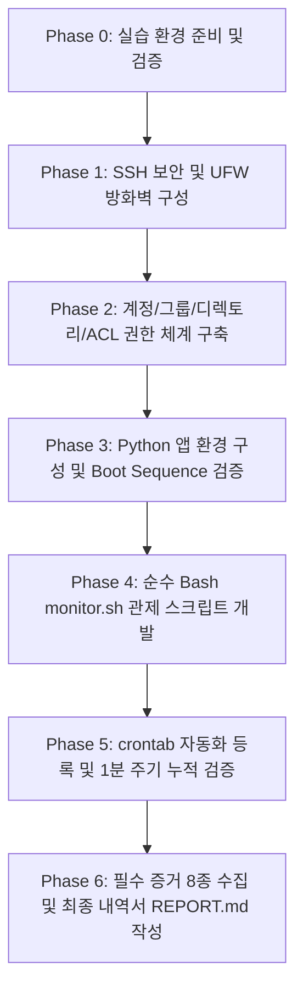

# [코디세이 B4-1] 시스템 관제 자동화 및 서버 보안/운영 환경 구축 마스터 플랜

---

## 1. 개요 및 목표

본 프로젝트는 리눅스(Ubuntu 22.04 LTS) 환경에서 다중 사용자 권한 관리, 네트워크 보안(SSH, 방화벽) 강화, 백그라운드 서비스 환경 구성, 그리고 시스템 리소스 관제 및 로그 관리를 자동화하는 순수 Bash 쉘 스크립트(`monitor.sh`)와 cron 스케줄링 환경을 구축하는 과제입니다.

이 계획서는 **"코디세이 b4-1"**의 모든 요구조건과 제약사항을 한눈에 파악하고, 단계를 나누어 빈틈없이 구현 및 검증할 수 있도록 작성된 세부 실행 가이드입니다.

---

## 2. 최종 산출물 및 제출 요구사항

| 구분 | 산출물 명칭 | 세부 내용 및 저장 위치 |
| :--- | :--- | :--- |
| **산출물 1** | **요구사항 수행 내역서** (문서 1개) | `REPORT.md` (또는 `EXECUTION_REPORT.md`)<br>- 설정 및 명령어 실행 기록<br>- **8가지 필수 증거 자료 체크리스트** 및 증적 로그 포함 |
| **산출물 2** | **자동화 스크립트 소스코드** | `$AGENT_HOME/bin/monitor.sh`<br>- 순수 Bash 스크립트<br>- 권한: 750 (`rwxr-x---`), 소유: `agent-dev:agent-core` |

### 📌 필수 증거 자료 8종 체크리스트
1. **[증거 1]** SSH 포트 변경 (`20022`) 및 Root 원격 접속 차단(`PermitRootLogin no`) 설정/확인 내역
2. **[증거 2]** 방화벽(UFW) 활성화 및 `20022/tcp`, `15034/tcp`만 허용된 상태 확인 내역
3. **[증거 3]** 계정(`agent-admin`, `agent-dev`, `agent-test`) 및 그룹(`agent-common`, `agent-core`) 생성 및 소속 확인 내역
4. **[증거 4]** 디렉토리 구조 및 권한(POSIX ACL 포함) 설정 확인 내역
5. **[증거 5]** 앱 Boot Sequence 5단계 `[OK]` 및 `“Agent READY”` 정상 실행 내역
6. **[증거 6]** `monitor.sh` 단독 실행 결과 (프로세스/포트/리소스/경고 메시지 출력)
7. **[증거 7]** `/var/log/agent-app/monitor.log` 로그 누적 기록 확인 (`tail -n 20` 등)
8. **[증거 8]** `agent-admin` crontab 매분 등록 및 자동 실행 확인 (1~2분 후 신규 라인 누적 증적)

---

## 3. 핵심 규칙 및 필수 제약사항 (Must Follow)

1. **언어 제약**: `monitor.sh`는 **오직 순수 Bash(쉘 스크립트)**로만 작성해야 합니다. (Python, Perl 등 대체 절대 금지)
2. **최소 권한 원칙**: 
   - 일상 작업 및 스크립트 실행은 일반 사용자(`agent-admin`, `agent-dev`)로 수행합니다.
   - `sudo`는 계정/패키지/방화벽/sshd 설정 등 시스템 관리 목적에만 최소한으로 사용합니다.
   - **애플리케이션은 절대 루트 계정으로 실행해서는 안 됩니다.**
3. **파일 권한 엄수**:
   - `monitor.sh`: 경로 `$AGENT_HOME/bin/monitor.sh`, 소유자 `agent-dev`, 그룹 `agent-core`, 권한 `750`.
   - `upload_files`: 그룹 `agent-common` R/W 허용 (권한 `770` 또는 ACL 적용).
   - `api_keys` 및 `/var/log/agent-app`: 오직 그룹 `agent-core`만 R/W 접근 가능 (다른 계정 완전 차단).
4. **Health Check vs Warning 구분**:
   - 앱 미실행 또는 포트(15034) 미리스닝 시: 즉시 표준에러 출력 후 **`exit 1`** 종료.
   - 방화벽 비활성, 리소스 임계값 초과(CPU > 20%, MEM > 10%, DISK > 80%) 시: **`[WARNING]` 출력만 하고 정상 계속 실행**.
5. **로그 관리**:
   - 로그 포맷 준수: `[YYYY-MM-DD HH:MM:SS] PID:... CPU:..% MEM:..% DISK_USED:..%`
   - 최대 10MB / 10개 파일 로테이션 정책 적용 (자체 로테이션 로직 내장 또는 logrotate 설정).

---

## 4. 단계별 세부 실행 계획 (Phase 0 ~ Phase 6)



---

### [Phase 0] 실습 환경 준비 및 기본 점검
- **목표**: Ubuntu 22.04 LTS 환경 확보 및 필수 패키지 설치 확인
- **주요 작업**:
  1. OS 버전 확인 (`cat /etc/os-release`)
  2. 필요 유틸리티 설치 여부 확인: `curl`, `ufw`, `openssh-server`, `acl`, `cron`, `procps`, `iproute2` (`ss`), `sysstat`
  3. Git 저장소 내 디렉토리 구조 초기화

---

### [Phase 1] 기본 보안 및 네트워크 인프라 설정
- **목표**: 원격 침입 차단 및 비인가 네트워크 포트 차단
- **세부 작업**:
  1. **SSH 포트 변경 및 Root 로그인 차단**:
     - `/etc/ssh/sshd_config` (또는 `/etc/ssh/sshd_config.d/codyssey.conf`) 편집
       - `Port 20022`
       - `PermitRootLogin no`
     - `sshd -t`로 문법 검증 후 `systemctl restart ssh` (또는 `ssh.service`)
     - **[증거 1 확보]**: `ss -tulnp | grep sshd` 및 `ssh -p 20022 ...` 접속 테스트 결과 기록
  2. **방화벽(UFW) 정책 수립 및 활성화**:
     - 기본 정책 차단: `sudo ufw default deny incoming`, `sudo ufw default allow outgoing`
     - 필수 포트만 허용:
       - `sudo ufw allow 20022/tcp comment 'SSH Port'`
       - `sudo ufw allow 15034/tcp comment 'Agent App Port'`
     - UFW 활성화: `sudo ufw --force enable`
     - **[증거 2 확보]**: `sudo ufw status verbose` 및 `sudo ufw status numbered` 결과 기록

---

### [Phase 2] 계정/그룹 체계 및 디렉토리 권한(ACL) 구축
- **목표**: 최소 권한 기반 협업 디렉토리 분리 설계
- **세부 작업**:
  1. **그룹 생성**:
     - `agent-common` (공통 작업용)
     - `agent-core` (핵심 보안 관리용)
  2. **사용자 계정 생성 및 보조 그룹 매핑**:
     - `agent-admin`: `agent-common`, `agent-core` (및 sudo 그룹 등록 권장)
     - `agent-dev`: `agent-common`, `agent-core`
     - `agent-test`: `agent-common`
     - `id agent-admin`, `id agent-dev`, `id agent-test`로 소속 검증
     - **[증거 3 확보]**: 계정 생성 및 id 명령어 결과 기록
  3. **디렉토리 구조 생성**:
     - 기준 경로: `AGENT_HOME` (예: `/home/agent-admin/agent-app` 또는 `/opt/agent-app`)
     - 서브 디렉토리:
       - `$AGENT_HOME/bin` (스크립트 위치)
       - `$AGENT_HOME/upload_files` (공유 디렉토리)
       - `$AGENT_HOME/api_keys` (보안 디렉토리)
       - `/var/log/agent-app` (시스템 로그 디렉토리)
  4. **권한 및 ACL(Access Control List) 설정**:
     - `$AGENT_HOME/upload_files`:
       - 소유자: `agent-admin`, 소유그룹: `agent-common`
       - 권한: `770` (소유자 및 agent-common 구성원 전원 R/W 가능, others 차단)
       - 필요시 setgid(`chmod 2770`) 또는 기본 ACL(`setfacl -d -m g:agent-common:rwx`) 적용
     - `$AGENT_HOME/api_keys`:
       - 소유자: `agent-admin`, 소유그룹: `agent-core`
       - 권한: `770` 또는 `750` (others 및 test 차단)
     - `/var/log/agent-app`:
       - 소유자: `agent-admin`, 소유그룹: `agent-core`
       - 권한: `775` 또는 `770` (core 그룹 쓰기 가능)
     - **[증거 4 확보]**: `ls -ld`, `getfacl` 실행 결과 기록

---

### [Phase 3] 애플리케이션 실행 환경 및 서비스 기동 검증
- **목표**: 환경 변수 고정 및 Boot Sequence 5단계 통과 검증
- **세부 작업**:
  1. **환경 변수 파일 정의 (`$AGENT_HOME/.env` 또는 profile)**:
     ```bash
     export AGENT_HOME="/home/agent-admin/agent-app"
     export AGENT_PORT=15034
     export AGENT_UPLOAD_DIR="$AGENT_HOME/upload_files"
     export AGENT_KEY_PATH="$AGENT_HOME/api_keys/t_secret.key"
     export AGENT_LOG_DIR="/var/log/agent-app"
     ```
  2. **API Secret Key 파일 생성**:
     - 경로: `$AGENT_HOME/api_keys/t_secret.key`
     - 내용: `agent_api_key_test` (정확히 1줄)
     - 권한: `640` (소유: `agent-admin:agent-core`)
  3. **애플리케이션 검증**:
     - 루트가 아닌 일반 계정(`agent-admin` 또는 `agent-dev`)으로 실행
     - Boot Sequence 5단계 [OK] 및 “Agent READY” 출력 확인:
       - [Step 1] 환경 변수 로드 확인 [OK]
       - [Step 2] API 키 파일 검증 [OK]
       - [Step 3] 업로드 디렉토리 접근 권한 확인 [OK]
       - [Step 4] 로그 디렉토리 쓰기 권한 확인 [OK]
       - [Step 5] 포트 바인딩 (0.0.0.0:15034) [OK]
       - `Agent READY`
     - **[증거 5 확보]**: 실행 화면 콘솔 캡처 및 `ss -tulnp | grep 15034` 결과 기록

---

### [Phase 4] 시스템 관제 자동화 스크립트 (`monitor.sh`) 개발
- **목표**: 순수 Bash 기반의 견고한 헬스체크 및 리소스 관제 스크립트 작성
- **파일 위치 및 퍼미션**:
  - 파일: `$AGENT_HOME/bin/monitor.sh`
  - 소유: `agent-dev:agent-core`
  - 권한: `chmod 750 $AGENT_HOME/bin/monitor.sh`
- **구현 상세 요구조건**:
  1. **안전 옵션**: `set -euo pipefail` 적용 (단, warning 단계는 파이프 에러 회피 처리)
  2. **Health Check (실패 시 즉시 exit 1)**:
     - [HC-1] 프로세스 검사: `agent_app.py` 프로세스가 실행 중인가? (`pgrep -f "agent_app.py"`) -> 미실행 시 `[ERROR] Process is not running`, `exit 1`
     - [HC-2] 포트 리슨 검사: TCP 15034가 LISTEN 중인가? (`ss -tuln | grep -q ":15034 "`) -> 미리스닝 시 `[ERROR] Port 15034 is not listening`, `exit 1`
  3. **방화벽 상태 점검 (경고만 출력)**:
     - `sudo ufw status` 또는 `ufw status` 결과가 `active`가 아니면 `[WARNING] Firewall is inactive` 출력 (스크립트는 계속 진행)
  4. **시스템 리소스 수집 & 임계값 경고**:
     - CPU 사용률(%): 100 - idle% 계산 (`top -bn1` 또는 `/proc/stat`)
       - `CPU > 20%` 이면 `[WARNING] CPU usage high: X% (>20%)`
     - Memory 사용률(%): `free -m` 기준 `(used / total) * 100`
       - `MEM > 10%` 이면 `[WARNING] Memory usage high: X% (>10%)`
     - Root Disk 사용률(%): `df -P /` 기준 Used %
       - `DISK_USED > 80%` 이면 `[WARNING] Disk usage high: X% (>80%)`
  5. **로그 기록**:
     - 기록 경로: `/var/log/agent-app/monitor.log`
     - 포맷: `[YYYY-MM-DD HH:MM:SS] PID:<APP_PID> CPU:<N>% MEM:<N>% DISK_USED:<N>%`
  6. **로그 로테이션 (최대 10MB, 10개 유지)**:
     - 스크립트 내장 로테이션 함수 또는 logrotate 연동 (10MB 초과 시 `monitor.log.1` ... `monitor.log.10` 순환 처리)
  7. **[증거 6 확보]**: 정상 상태 및 임계값 트리거 상태 콘솔 실행 결과 기록

---

### [Phase 5] cron 자동 실행 등록 및 실시간 주기성 검증
- **목표**: 무중단 1분 주기 관제 스케줄러 가동
- **세부 작업**:
  1. `agent-admin` 계정으로 crontab 편집 (`crontab -e`):
     ```bash
     * * * * * /home/agent-admin/agent-app/bin/monitor.sh >> /var/log/agent-app/cron_exec.log 2>&1
     ```
  2. crontab 등록 리스트 확인: `crontab -l`
  3. cron 데몬 동작 확인: `systemctl status cron`
  4. 2~3분간 대기하며 로그 누적 추적: `tail -f /var/log/agent-app/monitor.log`
  5. **[증거 7, 8 확보]**: 1분 간격으로 새 라인이 추가된 타임스탬프 증적 캡처

---

### [Phase 6] 종합 검증 및 최종 산출물 보고서(`REPORT.md`) 작성
- **목표**: 8가지 증거자료를 모두 포함한 공식 수행 내역서 완성
- **문서 구성**:
  - 1. 미션 개요 및 인프라 명세
  - 2. 단계별 수행 내역 및 상세 명령어 로그
  - 3. 8대 필수 증거자료 스크린샷 및 텍스트 증적
  - 4. 과제 목표 달성 자가 점검 (SSH 보안, 방화벽, 최소 권한/ACL, 환경변수 고정 이유, 로그 로테이션의 필요성 서술)

---

## 5. 단계별 검증 및 테스트 매트릭스

| 검증 단계 | 검증 시나리오 | 기대 결과 |
| :--- | :--- | :--- |
| **보안 검증** | SSH 22 포트 접속 시도 | Connection refused |
| **보안 검증** | SSH 20022 root 접속 시도 | Permission denied (publickey/password) 차단 |
| **방화벽 검증**| 80, 443 등 임의 포트 접속 시도 | UFW DROP/REJECT |
| **권한 검증** | `agent-test` 계정으로 `api_keys` 접근 시도 | Permission denied |
| **권한 검증** | `agent-dev` 계정으로 `upload_files` 파일 생성 | 정상 생성 (R/W 성공) |
| **스크립트 검증**| `agent_app.py` 강제 종료 후 `monitor.sh` 실행 | exit code 1 반환 및 에러 메시지 출력 |
| **스크립트 검증**| CPU/MEM 부하 유발 후 `monitor.sh` 실행 | `[WARNING]` 경고 메시지 출력 및 로그 기록 완료 |
| **cron 검증** | 3분간 로그 모니터링 | 정확히 3개 라인이 1분 간격으로 추가됨 |
