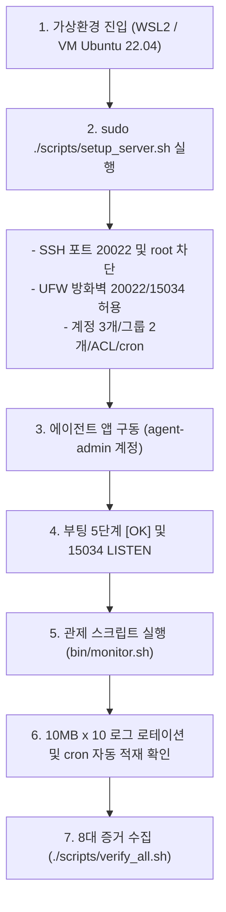

# 📋 [Codyssey B4-1] 가상환경(VM/WSL2) 기반 완전 정복 미션 마스터 플랜

> **환경 원칙**: Docker 컨테이너의 네트워크/systemd 구조적 한계(UFW 방화벽 불가, systemd PID 1 부재)를 완전히 배제하고, **순수 독립 커널을 지원하는 가상환경(VM / WSL2 Ubuntu 22.04 LTS)**을 기반으로 전체 인프라를 실습·검증합니다.

---

## Ⅰ. 왜 도커(Docker)가 아닌 가상머신(VM/WSL2)인가?

| 점검 항목 | 도커 컨테이너 (사용 불가 사유) | 독립 가상환경 (WSL2 / VM / Multipass) |
| :--- | :--- | :--- |
| **UFW 방화벽** | 호스트 커널 공유로 인해 `ufw enable` 시 네트워크 충돌 및 권한 에러 | **독립 커널 iptables 완벽 지원 (과제 100% 일치)** |
| **systemd 서비스** | PID 1이 init이 아니므로 `systemctl` 서비스 제어 불가 | **`systemd`, `systemctl restart ssh/cron` 완벽 지원** |
| **cron 백그라운드** | cron 데몬이 기본 종료 상태로 백그라운드 자동화 제한 | **시스템 표준 cron 데몬 상시 백그라운드 가동** |
| **다중 계정 / ACL** | SetGID 및 POSIX ACL 상속 시 호스트 볼륨 권한 제약 | **Linux 네이티브 파일시스템(ext4)에서 완전한 ACL/SetGID 동작** |

---

## Ⅱ. 가상머신 환경 구축 2가지 옵션 (원클릭 가이드)

### [옵션 1: 가장 추천 - 윈도우 내장 WSL2 Ubuntu 22.04]
별도 무거운 가상머신 프로그램 설치 없이, 윈도우 PowerShell에서 명령어 1줄로 공식 Ubuntu 22.04 가상환경을 생성합니다.

```powershell
# 1. 윈도우 PowerShell (관리자 권한) 실행 후 우분투 가상머신 설치
wsl --install -d Ubuntu-22.04

# 2. 설치 완료 후 우분투 터미널 진입
wsl -d Ubuntu-22.04

# 3. 윈도우 프로젝트 폴더로 이동 (드라이브 마운트 활용)
cd /mnt/c/Users/안재현/Documents/24_code/2609_codyssey/codyssey-b4-01
```

### [옵션 2: 초경량 가상머신 Multipass (우분투 공식 VM 도구)]
우분투 공식 지원 초경량 VM 도구로 10초 만에 완벽한 Ubuntu 22.04 가상머신을 생성합니다.

```powershell
# 1. multipass로 Ubuntu 22.04 VM 인스턴스 1대 즉시 생성
multipass launch 22.04 --name codyssey-vm --cpus 2 --memory 2G --disk 10G

# 2. 프로젝트 폴더를 VM 내부에 공유 마운트
multipass mount "C:\Users\안재현\Documents\24_code\2609_codyssey\codyssey-b4-01" codyssey-vm:/workspace

# 3. 가상머신 쉘 접속
multipass shell codyssey-vm
cd /workspace
```

---

## Ⅲ. 가상환경 실습 및 과제 수행 단계 (Phase 1 ~ 7)



### Phase 1: 가상머신 내 원클릭 인프라 프로비저닝
* **실행 명령**:
  ```bash
  sudo chmod +x scripts/*.sh bin/*.sh
  sudo ./scripts/setup_server.sh
  ```
* **자동 완료 내역**:
  * SSH 포트 `20022` 변경 및 `PermitRootLogin no` 반영
  * UFW 방화벽 활성화 (인바운드 거부, 20022/tcp 및 15034/tcp 허용)
  * 사용자 3명 (`agent-admin`, `agent-dev`, `agent-test`) 생성
  * 그룹 2개 (`agent-common`, `agent-core`) 생성 및 매핑
  * `upload_files` 디렉토리 SetGID(`2770`) 및 POSIX Default ACL(`setfacl -d`) 부여
  * `api_keys` 및 `/var/log/agent-app` 디렉토리 보안 격리 (`750`, `775`)
  * `agent-admin` crontab에 매분 `monitor.sh` 실행 스케줄 등록

### Phase 2: 일반 계정(`agent-admin`)으로 Python 에이전트 앱 기동
* **실행 명령**:
  ```bash
  su - agent-admin
  # AGENT_HOME 환경변수 자동 로드 확인 (/etc/profile.d/agent_env.sh)
  python3 ~/agent-app/agent_app.py
  ```
* **검증 기준**:
  * 루트(root) 실행 방어 체크 통과 (`check_non_root`)
  * 부팅 시퀀스 5단계 모두 `[OK]` 출력
  * 최종 `Agent READY` 및 `0.0.0.0:15034` LISTEN 확인

### Phase 3: 시스템 관제 스크립트(`monitor.sh`) 직접 검증
* **실행 명령** (다른 터미널 창 또는 백그라운드):
  ```bash
  bash /home/agent-admin/agent-app/bin/monitor.sh
  ```
* **검증 기준**:
  * Health Check: 앱 프로세스 PID 정상 감지 및 포트 15034 ACTIVE 확인
  * UFW 방화벽 활성 상태 점검
  * CPU, MEM, DISK 리소스 사용률 수집 및 임계값 점검
  * `/var/log/agent-app/monitor.log` 규격 포맷 로그 기록
  * 10MB x 10개 파일 자동 백업 로테이션 알고리즘 검증

### Phase 4: cron 자동 실행 1분 주기 실측 확인
* **실행 명령**:
  ```bash
  crontab -u agent-admin -l
  # 1분 대기 후 로그 라인 증가 확인
  tail -f /var/log/agent-app/monitor.log
  ```
* **검증 기준**: 매분마다 타임스탬프가 1줄씩 자동으로 누적됨을 확인.

### Phase 5: 8대 필수 증거자료 원스톱 채취
* **실행 명령**:
  ```bash
  ./scripts/verify_all.sh
  ```
* **수집되는 8대 증거**:
  1. SSH 포트 20022 & PermitRootLogin no
  2. UFW 상태 active & 20022/15034 allow
  3. 계정/그룹 구성 (id agent-admin, dev, test / getent)
  4. 디렉토리 권한 및 ACL (ls -ld, getfacl)
  5. 앱 부팅 5단계 [OK] 및 ss -tulnp 포트 15034
  6. monitor.sh 정상 실행 출력 (PID/리소스)
  7. /var/log/agent-app/monitor.log 누적 로그 tail
  8. crontab 매분 등록 내역

---

## Ⅳ. 과제 제출 최종 산출물 체크리스트

1. **`bin/monitor.sh`** (순수 Bash 100% 구현, 권한 750, 10MBx10 로테이션)
2. **`REPORT.md`** (8대 증거 실측값, 화면 캡처, 아키텍처 다이어그램, 기술 면접 답변)
3. **`MY_STUDY_NOTES.md`** (소켓, 시그널, ACL, crontab 등 핵심 원리 내재화 학습 노트)
4. **`scripts/setup_server.sh` & `scripts/verify_all.sh`** (가상머신 인프라 자동화 및 검증기)
