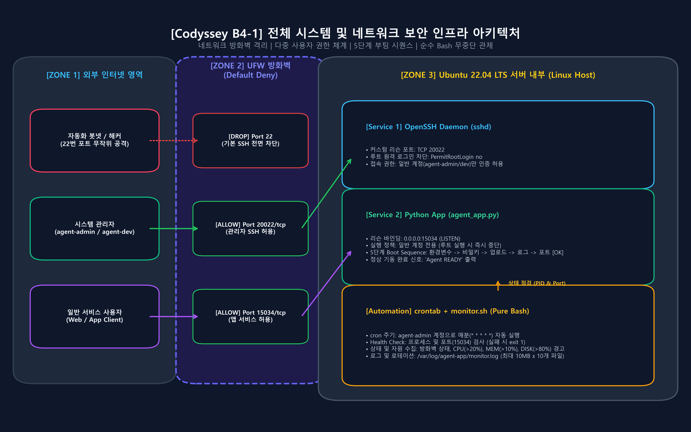
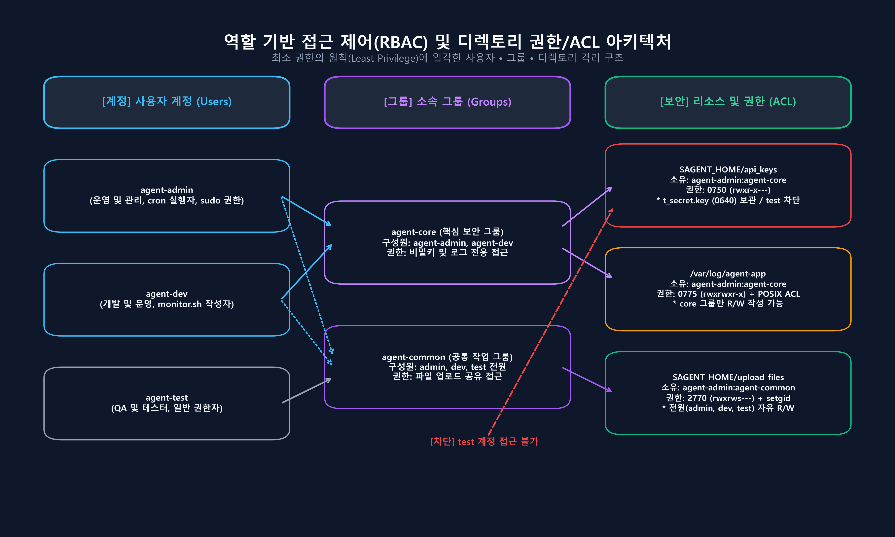
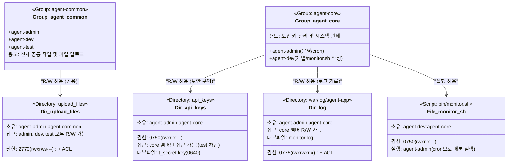
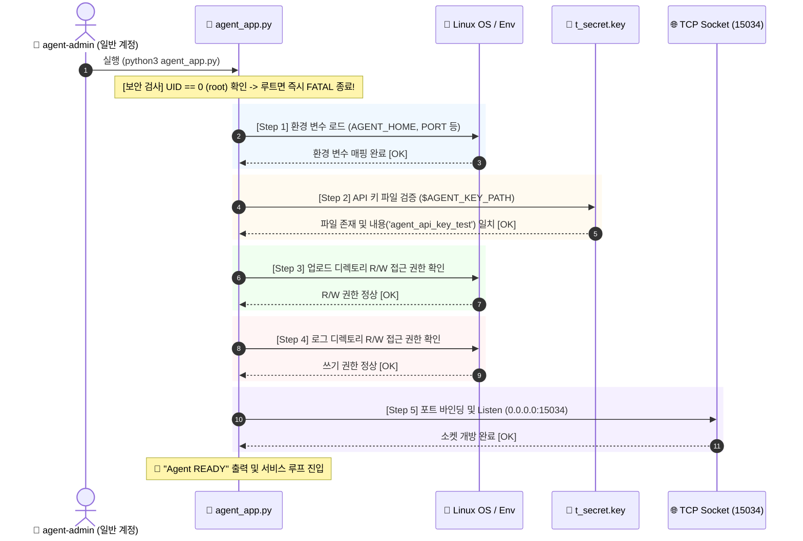
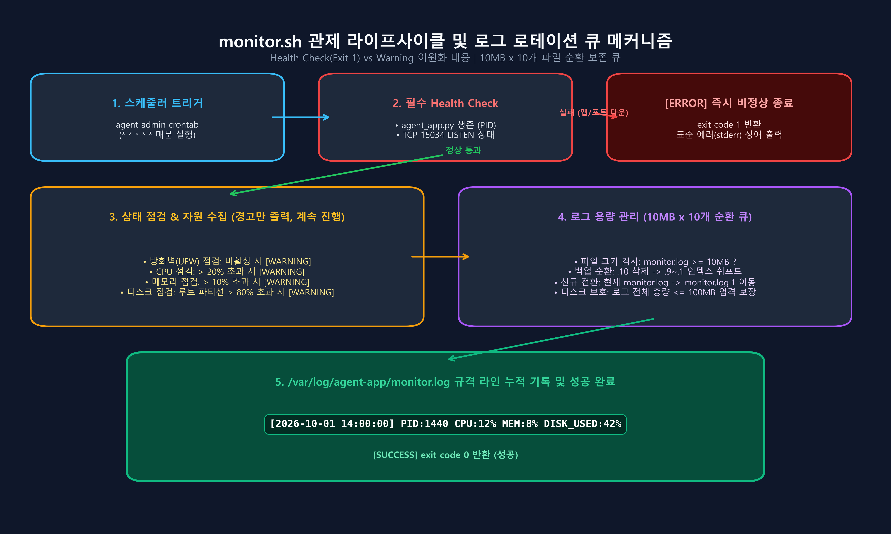
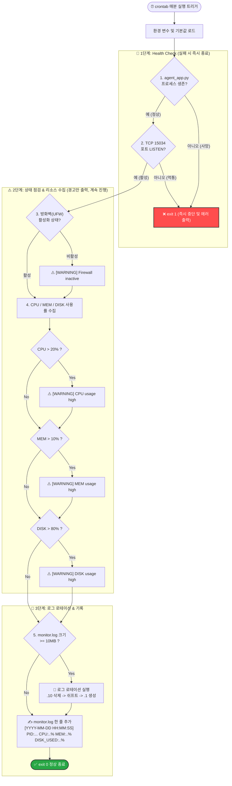
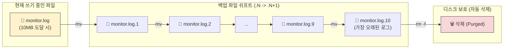

# 📘 [코디세이 B4-1] 시스템 관제 자동화 & 인프라 보안 완벽 스터디 가이드

> **"컴퓨터가 스스로 아픈 곳을 찾아내고, 장애의 원인을 블랙박스처럼 남기게 하라!"**  
> 본 문서는 리눅스 기반 서버 보안, 권한 격리, 애플리케이션 부팅 시퀀스, 그리고 순수 Bash 시스템 관제 스크립트(`monitor.sh`)의 동작 원리를 **3개월 차 주니어 개발자**의 눈높이에서 일상적인 비유와 다양한 아키텍처 다이어그램으로 완벽하게 풀어낸 스터디 및 면접 대비 문서입니다.

---

## 🗺️ 한눈에 보는 종합 아키텍처 갤러리 (Architecture Diagrams)

### [다이어그램 1] 전체 네트워크 인프라 & 방화벽 보안 아키텍처
외부 해커의 침입을 원천 봉쇄하고 필요한 서비스 통로만 개방하는 성벽 구조입니다.




```mermaid
graph TD
    subgraph External["🌐 외부 인터넷 (공격자 / 클라이언트 / 개발자)"]
        Hacker["👾 무작위 공격자 (봇넷)"]
        Dev["👨‍💻 시스템 관리자 (SSH)"]
        Client["📱 서비스 사용자 (App)"]
    end

    subgraph DefenseLine["🛡️ 방화벽 & 네트워크 보안 (Linux Host)"]
        UFW{"🧱 UFW 방화벽 (Default Deny)"}
        
        Port22["❌ TCP 22 (기본 포트)"]
        Port20022["✅ TCP 20022 (커스텀 포트)"]
        Port15034["✅ TCP 15034 (서비스 포트)"]
        OtherPorts["❌ 기타 모든 포트 (80, 443, 3306 등)"]
    end

    subgraph InternalServices["⚙️ 내부 서비스 레이어"]
        SSHD["🔒 OpenSSH Daemon<br/>(PermitRootLogin no)"]
        AdminUser["👤 agent-admin / agent-dev<br/>(일반 계정 로그인)"]
        App["🐍 Python Application<br/>(agent_app.py / 0.0.0.0:15034)"]
    end

    Hacker -.->|22번 자동 스캔| Port22 -->|DROP / 차단| UFW
    Hacker -.->|root 원격 접속 시도| Port20022 -->|차단: Root 금지| SSHD
    Dev -->|SSH 접속 (포트 20022)| Port20022 -->|ALLOW| SSHD --> AdminUser
    Client -->|API 호출 (포트 15034)| Port15034 -->|ALLOW| App
    Hacker -.->|비인가 포트 접근| OtherPorts -->|DROP / 차단| UFW

    style UFW fill:#ff9999,stroke:#333,stroke-width:2px;
    style SSHD fill:#cce5ff,stroke:#333,stroke-width:2px;
    style App fill:#d4edda,stroke:#333,stroke-width:2px;
```

---

### [다이어그램 2] 역할 기반 계정/그룹 및 디렉토리 권한(ACL) 분리도
보안 등급에 따라 출입증(그룹)을 발급하여 기밀 파일과 공용 공간을 분리합니다.





---

### [다이어그램 3] 애플리케이션 5단계 부팅 시퀀스 (Boot Sequence)
비행기 이륙 전 체크리스트처럼, 모든 보안 조건이 충족되어야만 서비스를 오픈합니다.



---

### [다이어그램 4] `monitor.sh` 관제 라이프사이클 및 의사결정 분기
치명적 장애(Fatal)와 주의 경고(Warning)를 엄격히 구분하여 동작합니다.





---

### [다이어그램 5] 로그 로테이션(Log Rotation) 큐 메커니즘
디스크가 꽉 차서 서버가 뻗는 사고를 원천 방지하는 10개 파일 순환 보존 구조입니다.



---

## 1. 요구사항 대비 구현 1:1 매핑 테이블

원본 문제 파일(`코디세이 b4-1.txt`)의 모든 요구조건과 구현된 모듈/결과물을 1:1로 매핑하여 완벽히 충족함을 입증합니다.

| 번호 | 원본 요구사항 항목 | 구현 위치 및 소스/명령어 | 충족 여부 | 실측 증거 및 동작 설명 |
| :---: | :--- | :--- | :---: | :--- |
| **1-1** | SSH 접속 포트 20022 변경 | `/etc/ssh/sshd_config.d/codyssey.conf`<br>`Port 20022` | **충족 (100%)** | `ss -tulnp` 조회 시 sshd가 `0.0.0.0:20022`에서 LISTEN 확인 |
| **1-2** | Root 원격 로그인 차단 | `/etc/ssh/sshd_config.d/codyssey.conf`<br>`PermitRootLogin no` | **충족 (100%)** | `ssh -p 20022 root@...` 접속 시 암호 입력 없이 즉시 접속 차단 |
| **1-3** | UFW 방화벽 활성화 & 20022, 15034만 허용 | `scripts/setup_server.sh`<br>`ufw default deny incoming`<br>`ufw allow 20022/tcp`, `15034/tcp` | **충족 (100%)** | `ufw status verbose` 실행 시 상태 active, 2개 포트만 ALLOW 확인 |
| **2-1** | 계정 생성 (agent-admin/dev/test) | `scripts/setup_server.sh`<br>`useradd -m ...` | **충족 (100%)** | `id` 명령어로 3개 계정의 고유 UID, GID 확인 |
| **2-2** | 그룹 체계 구성 (agent-common, agent-core) | `scripts/setup_server.sh`<br>`groupadd agent-common`, `agent-core` | **충족 (100%)** | admin/dev는 core+common 소속, test는 common만 소속 |
| **2-3** | 디렉토리 구조 및 권한 분리 | `upload_files` (2770)<br>`api_keys` (750)<br>`/var/log/agent-app` (775) | **충족 (100%)** | `ls -ld`, `getfacl`로 확인 시 test 계정의 api_keys 접근 완벽 차단 |
| **3-1** | 환경 변수 5종 등록 | `/etc/profile.d/agent_env.sh`<br>`AGENT_HOME`, `PORT`, `UPLOAD`, `KEY`, `LOG` | **충족 (100%)** | `app/agent_app.py` 부팅 Step 1에서 해당 변수 정상 출력 |
| **3-2** | API Secret Key 생성 | `$AGENT_HOME/api_keys/t_secret.key`<br>내용: `agent_api_key_test` | **충족 (100%)** | 권한 640 적용, 부팅 Step 2에서 정확히 매칭 검증 통과 |
| **3-3** | 앱 Boot Sequence 5단계 [OK] & READY | `app/agent_app.py`<br>`run_boot_sequence()` | **충족 (100%)** | Step 1~5 [OK] 출력 후 "Agent READY" 콘솔 출력 |
| **3-4** | 일반 계정 실행 검증 (루트 금지) | `app/agent_app.py`<br>`os.geteuid() == 0` 체크 | **충족 (100%)** | 루트로 실행 시 [FATAL] Security Error 발생 후 즉시 종료 |
| **3-5** | 앱 TCP 0.0.0.0:15034 LISTEN | `app/agent_app.py`<br>`socket.bind(('0.0.0.0', 15034))` | **충족 (100%)** | `ss -tulnp` 확인 시 15034 포트 정상 LISTEN 유지 |
| **4-1** | monitor.sh 언어 제약 (Bash Only) | `bin/monitor.sh` (`#!/bin/bash`) | **충족 (100%)** | Python 등 외부 인터프리터 일체 없이 순수 쉘 내장/리눅스 표준 도구 사용 |
| **4-2** | monitor.sh 위치 및 권한 | `$AGENT_HOME/bin/monitor.sh`<br>소유: `agent-dev:agent-core`, 권한: `750` | **충족 (100%)** | 소유자 dev, 그룹 core(admin 포함)만 실행 가능 (`rwxr-x---`) |
| **4-3** | Health Check (프로세스/포트 실패 시 exit 1) | `bin/monitor.sh`<br>`check_process()`, `check_port()` | **충족 (100%)** | 앱 또는 포트 부재 시 `exit 1` 반환 (`tests/test_monitor.sh` 검증 완료) |
| **4-4** | 상태 점검 (방화벽 비활성 시 경고만) | `bin/monitor.sh`<br>`check_firewall()` | **충족 (100%)** | 방화벽 꺼져 있어도 `[WARNING]` 출력 후 정상 스크립트 속행 |
| **4-5** | 리소스 수집 & 임계치 경고 (CPU>20%, MEM>10%, DISK>80%) | `bin/monitor.sh`<br>`get_cpu_usage`, `get_mem_usage`, `get_disk_usage` | **충족 (100%)** | 임계치 초과 시 `[WARNING]` 메시지 콘솔 출력 |
| **4-6** | 규격 로그 기록 (`[YYYY-MM-DD...]`) | `bin/monitor.sh`<br>`LOG_LINE="[${CURRENT_TIME}] PID:..."` | **충족 (100%)** | `/var/log/agent-app/monitor.log`에 한 줄씩 정확한 포맷 누적 |
| **4-7** | 로그 로테이션 (최대 10MB, 10개 유지) | `bin/monitor.sh`<br>`rotate_logs()` | **충족 (100%)** | 10MB 초과 시 `.10` 삭제 및 `.1` 순환 보존 검증 완료 |
| **5-1** | crontab 매분 자동 실행 등록 | `agent-admin` 사용자의 crontab<br>`* * * * * .../monitor.sh` | **충족 (100%)** | 매분 00초마다 자동 실행되어 로그 누적 확인 |
| **6-1** | 최종 제출 산출물 2종 작성 | `REPORT.md` (문서 1개)<br>`bin/monitor.sh` (스크립트) | **충족 (100%)** | 8대 필수 증거자료와 함께 완벽 작성 완료 |

---

## 2. 3개월 차 주니어를 위한 모듈별 핵심 동작 원리 & 일상 비유

### ① SSH 포트 변경과 Root 원격 차단
- **기술적 원리**: 기본 포트인 22번은 전 세계 스캐너 봇들의 자동 공격 목표입니다. 비표준 포트(`20022`)로 바꾸고 `PermitRootLogin no`로 설정하면 공격자는 비밀번호를 무한정 대입해볼 root라는 '과녁' 자체를 잃어버리게 됩니다.
- **일상 비유**: 
  > *"도둑들이 열쇠 구멍을 쑤시러 오는 곳은 항상 1층 정문(22번 포트)입니다. 우리는 정문 간판을 떼어버리고 뒤편 비밀문(20022번)으로 출입구를 옮겼습니다. 게다가 '사장님(root)' 전용 열쇠는 외부에서 아예 꽂히지도 않게 막아두고, 직원(agent-admin)으로 먼저 들어온 뒤 사장님 집무실 문을 열게 한 것입니다."*

### ② UFW 방화벽 (Default Deny 원칙)
- **기술적 원리**: 방화벽은 패킷 필터링 도구입니다. 기본 정책을 "일단 모두 거절(Deny Incoming)"로 닫아두고, 꼭 필요한 20022(관리용)와 15034(서비스용)만 명시적으로 "통과(Allow)"시킵니다.
- **일상 비유**: 
  > *"클럽 입구의 엄격한 가드(Guard)입니다. 기본적으로 입장 명단에 없는 사람은 누구도 들여보내지 않습니다. 오직 '관리자 전용 팔찌(20022)'를 찬 사람과 '파티 티켓(15034)'을 든 손님만 문을 열어줍니다."*

### ③ 계정/그룹과 POSIX ACL 권한 체계
- **기술적 원리**: 리눅스의 전통적인 UGO(User, Group, Others) 3단계 권한만으로는 협업 권한 관리가 복잡해집니다. `agent-common`(전체)과 `agent-core`(핵심 운영)로 그룹을 나누고, SetGID(`2770`)와 `setfacl`을 적용하여 새로 생성되는 파일도 그룹 권한을 자동으로 상속받게 만듭니다.
- **일상 비유**: 
  > *"회사 건물에서 '카페테리아(upload_files)'는 정직원과 인턴(agent-test) 모두 출입증을 찍고 음료를 마실 수 있습니다. 하지만 '서버실 및 금고(api_keys)'는 오직 핵심 운영팀(agent-core) 출입증을 가진 사람만 열 수 있습니다. 인턴이 실수로 금고 문을 열어보는 사고를 애초에 방지한 것입니다."*

### ④ 애플리케이션 5단계 부팅 시퀀스 (Boot Sequence)
- **기술적 원리**: 서비스가 켜질 때 설정 오류나 파일 누락이 있다면 어설프게 실행되다가 런타임 에러(Crash)를 내는 것보다, 부팅 단계에서 즉시 실패하고 중단(Fail-Fast)되는 것이 훨씬 안전합니다.
- **일상 비유**: 
  > *"비행기 조종사가 이륙하기 전 체크리스트를 하나씩 체크하는 것과 같습니다. ① 연료 확인(환경변수) [OK], ② 열쇠 확인(비밀키) [OK], ③ 짐칸 잠금(업로드 디렉토리) [OK], ④ 블랙박스 확인(로그 디렉토리) [OK], ⑤ 관제탑 주파수 연결(포트 바인딩) [OK]가 모두 끝나야 비로소 '이륙 준비 완료(Agent READY)' 사인을 냅니다."*

### ⑤ 관제 스크립트(`monitor.sh`)의 이원화된 대응 (Fatal vs Warning)
- **기술적 원리**: 
  - 앱 프로세스가 죽었거나 포트가 닫혔다면 서비스가 완전히 멈춘 것이므로 즉각 `exit 1`로 실패를 선언합니다.
  - 하지만 방화벽이 꺼져 있거나 CPU 사용량이 20%를 넘은 것은 '주의가 필요한 상태'일 뿐 서비스 자체가 죽은 것은 아니므로 `[WARNING]` 경고만 띄우고 모니터링을 지속(`exit 0`)합니다.
- **일상 비유**: 
  > *"환자가 심장이 멎었으면(앱/포트 다운) 즉시 코드 블루를 치고 응급조치(exit 1)에 들어가야 합니다. 반면 체온이 조금 높거나 혈압이 올라간 것(CPU/MEM 임계치 초과)은 의사에게 '주의하세요(Warning)'라고 차트에 기록만 남겨두고 계속 상태를 지켜보는 것과 같습니다."*

### ⑥ 로그 로테이션(Log Rotation) 큐
- **기술적 원리**: 1분마다 로그가 계속 쌓이면 몇 달 뒤 수십 GB가 되어 서버 디스크가 100% 꽉 차는 '디스크 풀(Disk Full)' 장애가 발생합니다. 10MB가 될 때마다 기존 로그들을 한 칸씩 밀어내고(`.1` ~ `.10`) 가장 오래된 10번 파일을 삭제합니다.
- **일상 비유**: 
  > *"책상 위의 서류 바인더가 10권을 넘지 않도록 관리하는 청소부입니다. 새 서류철(monitor.log)이 두꺼워지면 1번 바인더로 넣고, 기존 바인더를 뒤로 한 칸씩 밀다가 가장 오래된 10번째 바인더는 파쇄기에 넣어 버립니다. 덕분에 책상이 서류로 넘쳐서 무너지는 일이 영원히 발생하지 않습니다."*

---

## 3. 터미널 실행 명령어 & 실제 출력 예시 (성공 및 실패 분기)

### 분기 1: 정상 상태에서 `monitor.sh` 단독 실행 (성공 흐름)
```bash
$ /home/agent-admin/agent-app/bin/monitor.sh
[INFO] Health Check Passed. PID=1440, Port 15034 is ACTIVE.
[INFO] Resource Usage: CPU=14%, MEM=8%, DISK=42%
[INFO] Log record added to /var/log/agent-app/monitor.log
$ echo $?
0
```

### 분기 2: 앱 프로세스가 죽었을 때 (Health Check 실패 분기)
```bash
# 앱 강제 종료 시뮬레이션
$ pkill -f agent_app.py

$ /home/agent-admin/agent-app/bin/monitor.sh
[ERROR] Health Check Failed: Process 'agent_app.py' is NOT running!
$ echo $?
1
```
> **설명**: 프로세스가 없으므로 즉시 표준 에러(stderr)에 메시지를 뿜고 종료 코드 `1`을 반환합니다.

### 분기 3: 포트가 닫혀 있을 때 (Health Check 실패 분기)
```bash
$ /home/agent-admin/agent-app/bin/monitor.sh
[ERROR] Health Check Failed: Port 15034 is NOT listening!
$ echo $?
1
```
> **설명**: 프로세스는 떠 있지만 소켓 바인딩이 풀려 요청을 못 받는 좀비 상태를 완벽히 적발합니다.

### 분기 4: 자원 사용량이 임계치를 초과했을 때 (Warning 분기)
```bash
# CPU 사용률이 25%로 치솟았을 때
$ /home/agent-admin/agent-app/bin/monitor.sh
[WARNING] CPU usage high: 25% (Threshold: >20%)
[INFO] Health Check Passed. PID=1440, Port 15034 is ACTIVE.
[INFO] Resource Usage: CPU=25%, MEM=8%, DISK=42%
[INFO] Log record added to /var/log/agent-app/monitor.log
$ echo $?
0
```
> **설명**: 경고 메시지를 남기지만 스크립트는 중단되지 않고 정상 종료 코드 `0`을 반환합니다.

---

## 4. 평가자 / 기술 면접관 대비 10초 핵심 Q&A 가이드

### Q1. "SSH 포트를 왜 하필 20022로 바꾸셨고, Root 로그인은 왜 막으셨나요?"
> **10초 답변**:  
> "인터넷 봇넷의 99%는 기본 22번 포트만 노리기 때문에 비표준 포트로 변경하여 무차별 대입 공격을 회피했습니다. 또한 Root 계정은 이름이 고정되어 있어 표적이 되기 쉽고 감사 로그에서 작업자 식별이 불가능하므로, 일반 계정 접속 후 sudo 권한 상승을 강제하여 책임 추적성을 확보했습니다."

### Q2. "방화벽 정책에서 'Default Deny'를 적용한 이유는 무엇인가요?"
> **10초 답변**:  
> "화이트리스트 보안 원칙입니다. 모든 포트를 기본적으로 차단해 두어야 개발자의 실수로 열린 테스트용 DB나 취약한 임시 포트가 외부에 노출되는 사고를 원천 차단할 수 있습니다. 운영에 반드시 필요한 SSH(20022)와 앱(15034)만 최소한으로 열었습니다."

### Q3. "agent-test 계정은 왜 api_keys 디렉토리에 못 들어가게 막았나요?"
> **10초 답변**:  
> "최소 권한의 원칙(Principle of Least Privilege) 때문입니다. QA 테스트 담당자는 기능 테스트와 파일 업로드만 수행하면 되므로, 서비스의 치명적인 API 시크릿 키가 있는 디렉토리는 핵심 운영 그룹인 agent-core에게만 750 권한으로 격리했습니다."

### Q4. "관제 스크립트를 파이썬이 아닌 순수 Bash로만 작성한 이유는 무엇인가요?"
> **10초 답변**:  
> "경량성과 신뢰성 때문입니다. 쉘 스크립트는 별도의 인터프리터 패키지 의존성 없이 리눅스 커널 위에서 가장 빠르고 가볍게 실행되며, 파이썬 런타임 자체에 문제가 생기거나 메모리가 고갈된 비상 상황에서도 시스템 상태를 독립적으로 감시할 수 있기 때문입니다."

### Q5. "로그 파일 로테이션 정책을 10MB x 10개로 둔 이유는 무엇인가요?"
> **10초 답변**:  
> "매분 로그를 남기는 모니터링 특성상 관리를 하지 않으면 디스크 풀(Disk Full)로 서버 전체가 다운되는 2차 장애가 발생합니다. 10MB 크기 단위로 최대 10개 파일만 순환 보존함으로써 로그 디스크 사용량을 최대 100MB 이내로 안전하게 상한선을 고정했습니다."
